 Vodafone Automation
----

**Software Required**
 - Java 8
 - Appium 1.19.1
 - Selenium 3.141.0
 - Jenkins (CI/CD)
 - Eclipse (IDE)
 - Android Studio
 - Maven
 - Git

**Project Structure**
 
 |Resources|Folder Structure|
 -------------|---------------
 |Configuration files|`src/main/resources`|
 |Locators| `src/test/java/com/vodafone/locators`|
|Feature Files|`src/test/resources/features`|
 |Step Definitions|`src/test/java/com/vodafone/stepdefs`|
 |Runner Files|`src/test/java/runners`|
 |Utilies|`src/test/java/com/vodafone/utils`|
 |App Files|`src/test/resources/APK`|
 |Automation Control Sheet|`src/test/resources/ExcelFiles/AutomationControlSheet.xlsx`|
 |Test Data|`src/test/resources/testData`|
 |TestNG Files|`testNGFiles`|
 |Reports|`ExecutionReports/HTMLReports`|
 
 
 **Framework Setup**
 * Install `Java`
 * Install `Appium` (GUI and CLI)
 * Download and install `Android Studio`
 * Configure `testNG`
 * Install and configure `maven`
 * Install `git`
 * Configure `environment variables` for java,appium, maven and git 
 * Download `jenkins.war` file and setup a job in jenkins
 * Download and install `Eclipse IDE`
 * To execute the scripts from terminal/command prompt
```
mvn test -DplatformName=Android -DdeviceName=<DeviceUnderTest> -Dudid=<DUTUDID> -DappiumPort=<4digitPortNumberWhereAppiumShouldRun>
```
**Creating Jenkins Job**
 * Log on to your jenkins (If you're using local Jenkins server your URL typically be `https://localhost:8080`)
 * Click on `New Item` on the left pane
 
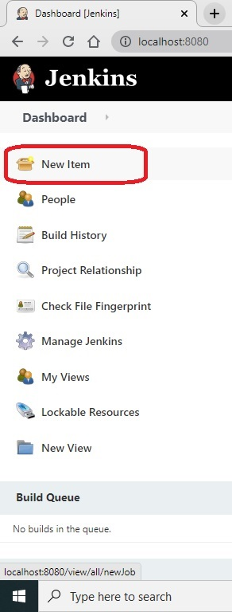

 * Enter the job name for example `Vodafone Regression`
 * Select Project type as `Freestyle Project`
 * Click on `Ok` button
 
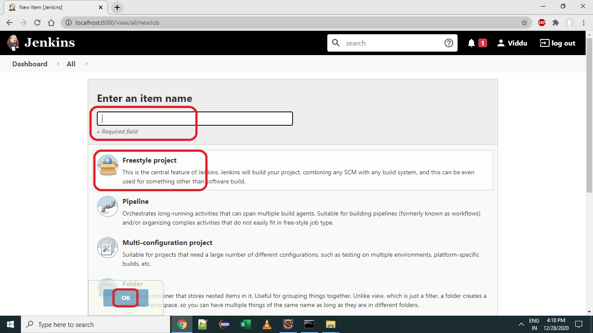

 * On the next screen (Job configuration screen), Under `General`, select checkbox labelled as `This project is parameterized`
 * Click on `Add Parameter` and then select `String Parameter` 
 * Select `Git` radio button under `Source Code Management` and provide the URL, credentials for the git repository
 
 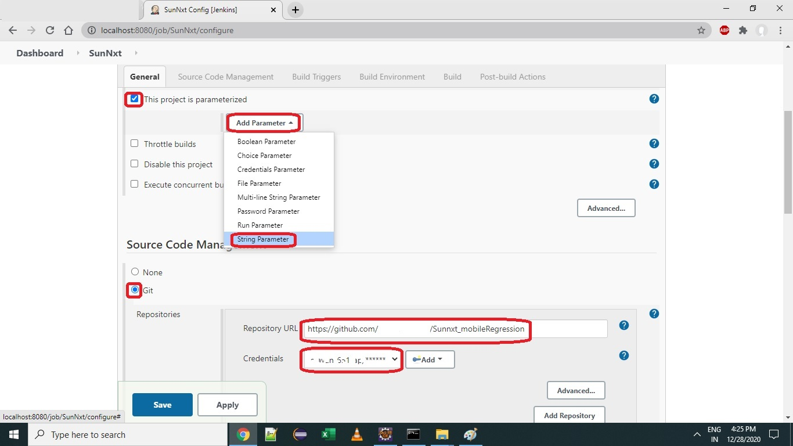
 
 * Add the following parameters 
 
 |Parameter Name|Parameter Value|
 ---------------|----------------
 |`platformName`|`Android` or `iOS`|
 |`deviceName`|`<Name of the Device Under Test>`|
 |`udid`|`<UDID of the Device Under Test>`|
 |`appiumPort`|`<4-digit port number which can be used by Appium>`|
 
 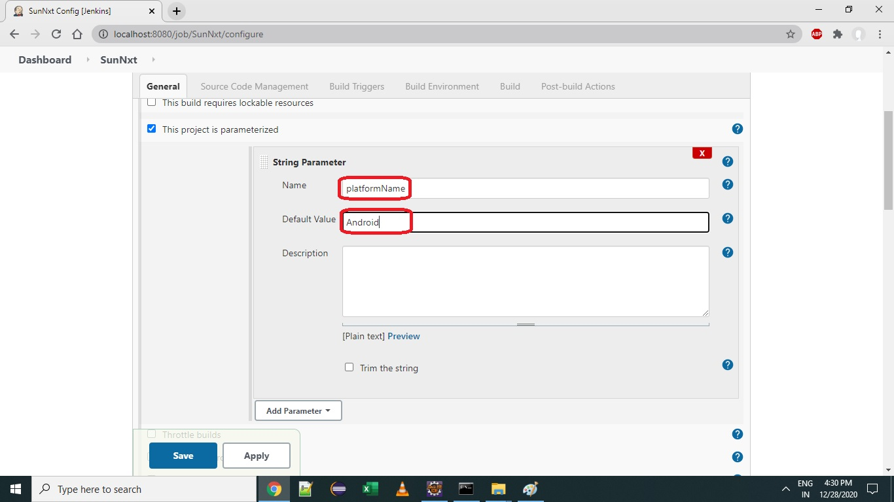
 
 * Under `Build`, click on `Add Build Step` and select `Invoke top-level Maven Targets`

 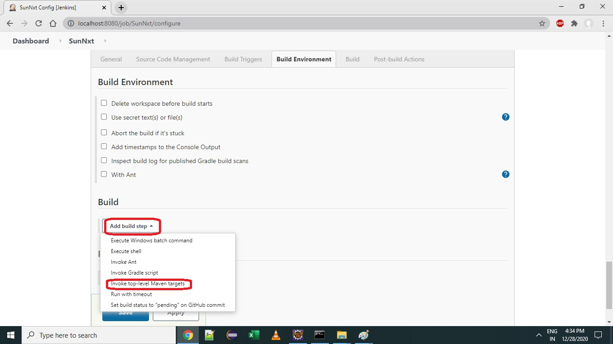
 
 * Provide the following string in to the `Goals` text box and click on `Save` button
 
 ```
 test -DplatformName=${platformName} -DdeviceName=${deviceName} -Dudid=${udid} -DappiumPort=${appiumPort}
 ```
 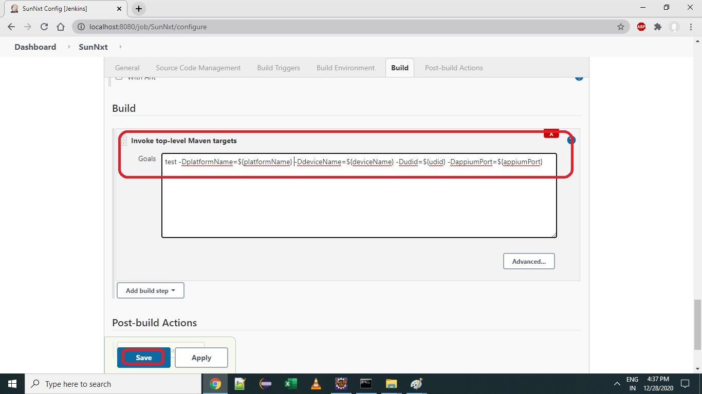
 
 * Click on `Build with Parameters` and provide the appropriate values (If you wish to change the default values you can do that here.)
 
 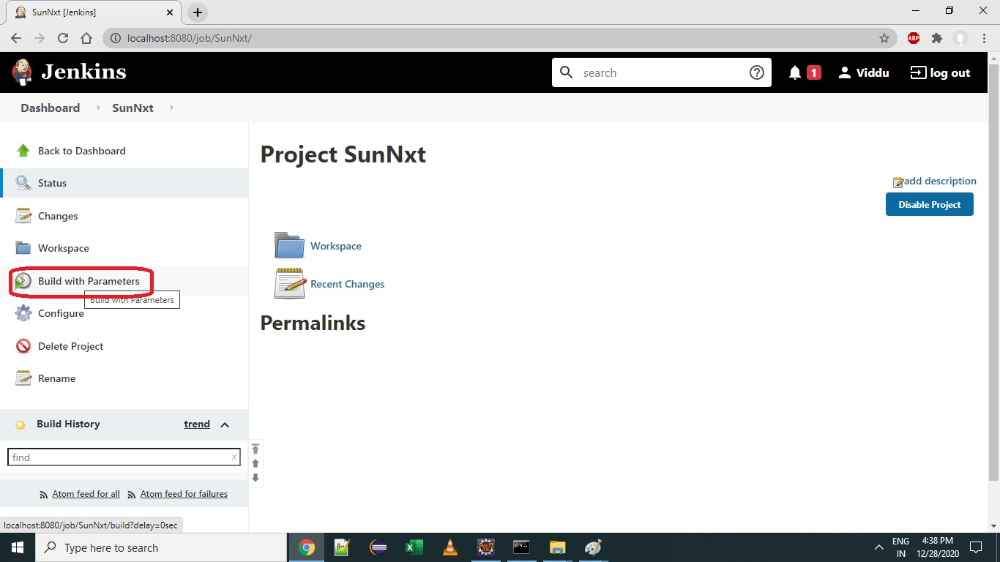
 
 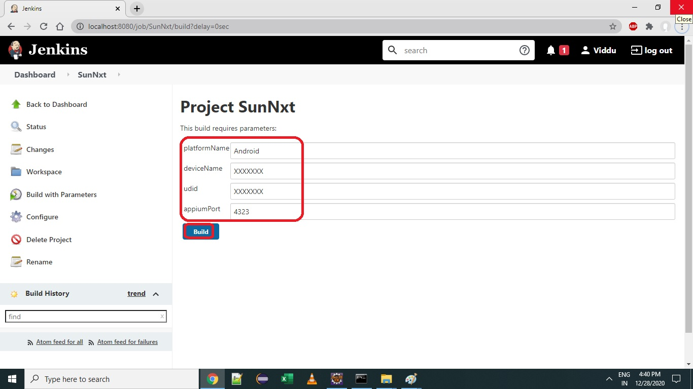
 
 * Click on `Build` to trigger the automation execution you can see progress bar with build number and time stamp (as in below image)
 
 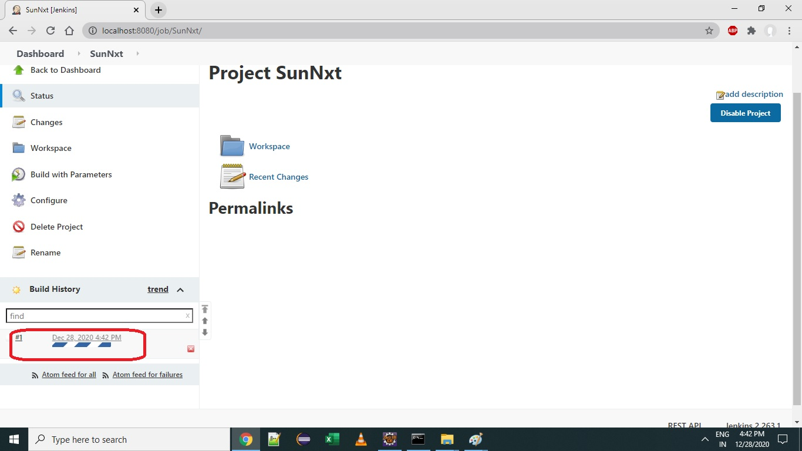
 
 * To see the logs, click on the build number and then on the `Console Output`
 
 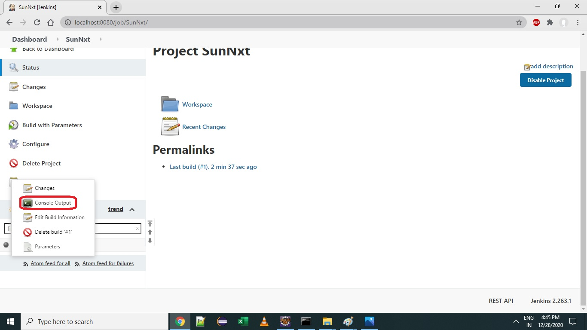

 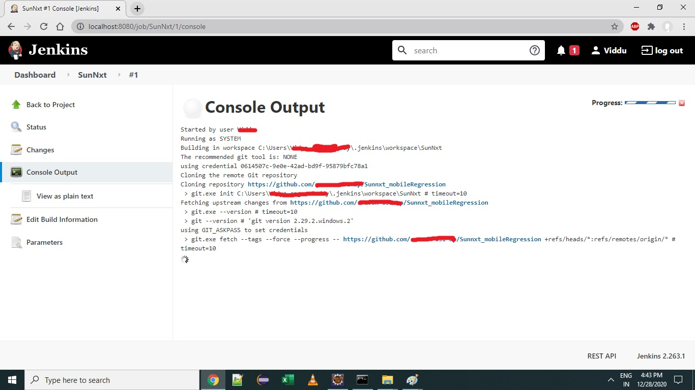
 